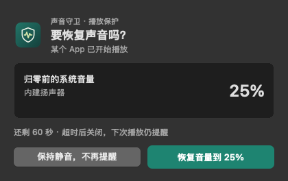
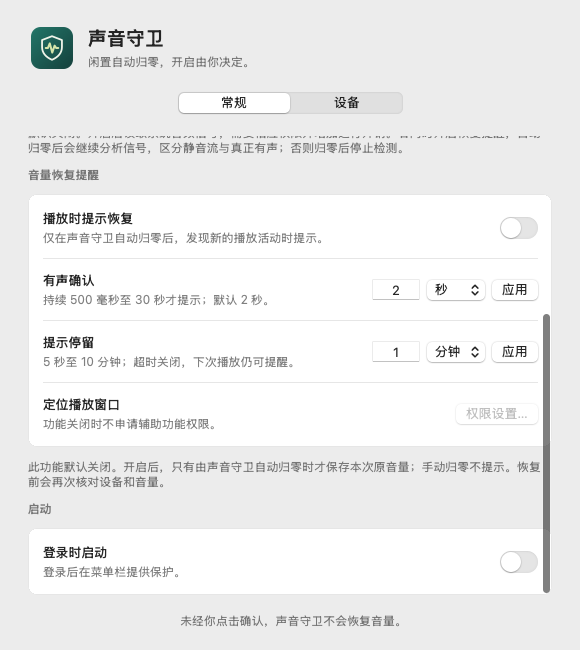
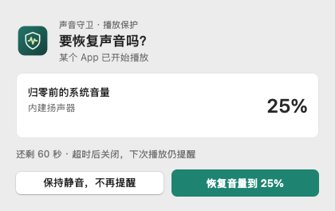
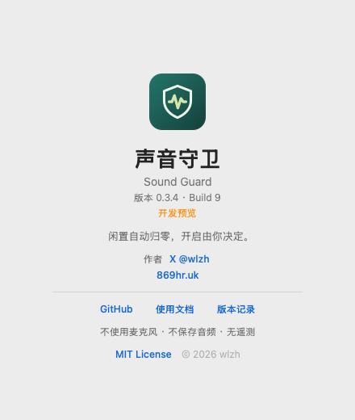

# Sound Guard · 声音守卫

面向 macOS 的声音管理 App：输出音量开启后，长时间没有播放活动便自动把系统输出音量设为 0；未经你点击确认，绝不恢复音量。


**v0.3.6 / build 11：开发预览。** 修正严格检测“等待音频源才启动”的配置错误，解决无播放时无法收到回调、进入故障并停止归零的问题。v0.3.5 的冷却方案未解决根因。本机已验证严格模式空闲 1 分钟自动归零；其他设备、权限和长期性能限制见[测试报告](docs/TESTING.md)。

上图为 v0.2.0 实机截图。以下为 v0.3.4 使用模拟数据生成的原生恢复提示预览：



## 功能

- 菜单栏驻留，默认空闲 5 分钟归零，可设置 1–120 分钟。
- 默认仅保护内建扬声器。其他输出设备逐项勾选，只有成为系统默认输出时才检测，不修改闲置设备。
- “静音流也计时”默认关闭。开启后额外分析系统输出的数字静音，不采集麦克风。
- 恢复提醒默认关闭；关闭时，音量为 0 会停止播放检测与空闲计时。
- 开启恢复提醒后，仅在本 App 自动归零时保存本次设备和各音量通道原值；默认模式保留低开销播放事件监听，严格静音流模式复用已有信号检测。
- 新的播放活动需持续达到“有声确认”时长才提示，默认 2 秒，可设置 500 毫秒至 30 秒；播放中断后重新计时。
- 发现新的播放活动时，在播放 App 所在显示器右上角弹出确认窗口；无法定位时回退到鼠标所在显示器。
- 默认倒计时 60 秒，可设 5 秒至 10 分钟。点击“保持静音，不再提醒”会结束本次恢复监测；左上角关闭或超时只是临时收起，下次播放仍可提示；只有点击“恢复音量到 …%”才恢复。
- 手动归零不建立恢复凭据；设备、路由、静音或音量变化会使旧请求失效，退出后不保留。
- 不使用麦克风、不保存音频、不上传数据；首版暂不包含麦克风管理。
- 播放中不归零；设备切换、睡眠唤醒、错误恢复重新给予完整等待时间。
- 状态、暂停、立即归零、设置、登录启动、关于及许可证入口。

**两种空闲检测模式通常只在非零音量时运行。** 默认模式监听输出播放活动；“静音流也计时”会分析系统输出信号。只有恢复提醒已开启且由本 App 自动归零时，默认模式继续监听播放事件，严格模式继续分析信号以避免把持续静音流误报为新播放。辅助功能只用于定位播放窗口：功能关闭时不申请；开启时先解释再请求；拒绝后自动回退，不影响归零功能。

## 文档与检查

- [v0.3.0 产品需求与验收清单](docs/prd/v0.3.0/prd.md)
- [v0.3.1 静音流恢复提示修正](docs/prd/v0.3.1/prd.md)
- [v0.3.2 品牌提示与恢复浮层设计](docs/prd/v0.3.2/prd.md)
- [v0.3.3 恢复提示选择语义](docs/prd/v0.3.3/prd.md)
- [v0.3.4 有声确认时长](docs/prd/v0.3.4/prd.md)
- [v0.3.5 重新核对生命周期修复](docs/prd/v0.3.5/prd.md)
- [v0.3.6 无播放时严格检测修正](docs/prd/v0.3.6/prd.md)
- [文档索引及交付状态](docs/README.md)
- [测试状态与发布门禁](docs/TESTING.md)
- [贡献说明](CONTRIBUTING.md)、[安全说明](SECURITY.md)、[版本记录](CHANGELOG.md)

## 构建与使用

需要 macOS 14.2+ 和 Swift 5.10+ 工具链。无需第三方运行时、驱动或麦克风权限。辅助功能权限仅为可选的播放窗口定位服务。App 仅菜单栏驻留，没有 Dock 图标。

```sh
zsh scripts/test-all.sh
zsh scripts/build-app.sh
open "dist/Sound Guard.app"
```

## 作者与许可

作者：[wlzh](https://github.com/wlzh)。网站：[869hr.uk](https://869hr.uk)。
分发包由 `zsh scripts/package-release.sh` 生成 Universal ZIP 和 SHA256。当前仅 ad-hoc 签名、未公证；安装和系统拦截处理见[安装指南](docs/INSTALL.md)。公开 Release 可直接下载。

源码采用 [MIT License](LICENSE)。仓库公开开源。关于窗口展示版本、作者、网站及项目链接，完整协议通过独立面板查看。

## 界面

盾牌与声波组成品牌标记，菜单栏使用单色模板，App 图标使用绿色底色。设置拆分为常规和设备页；关于页参考同作者两个原生工程重设计。

以下为真实原生视图使用模拟设备生成的预览，不包含用户设备数据。




