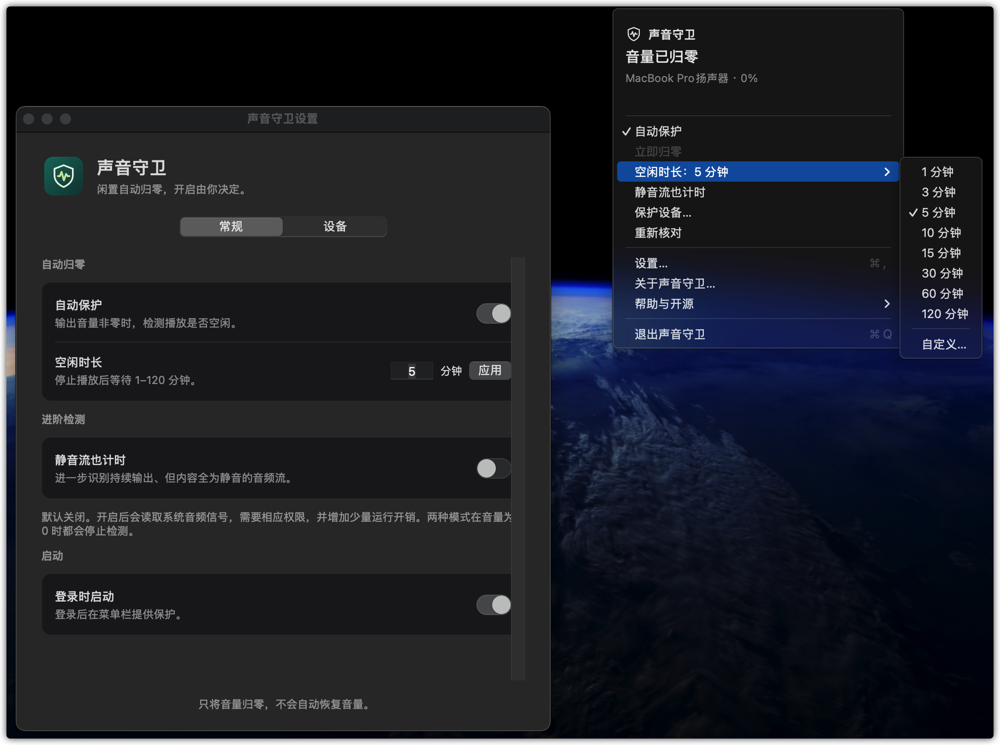
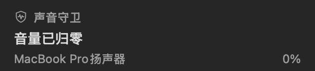
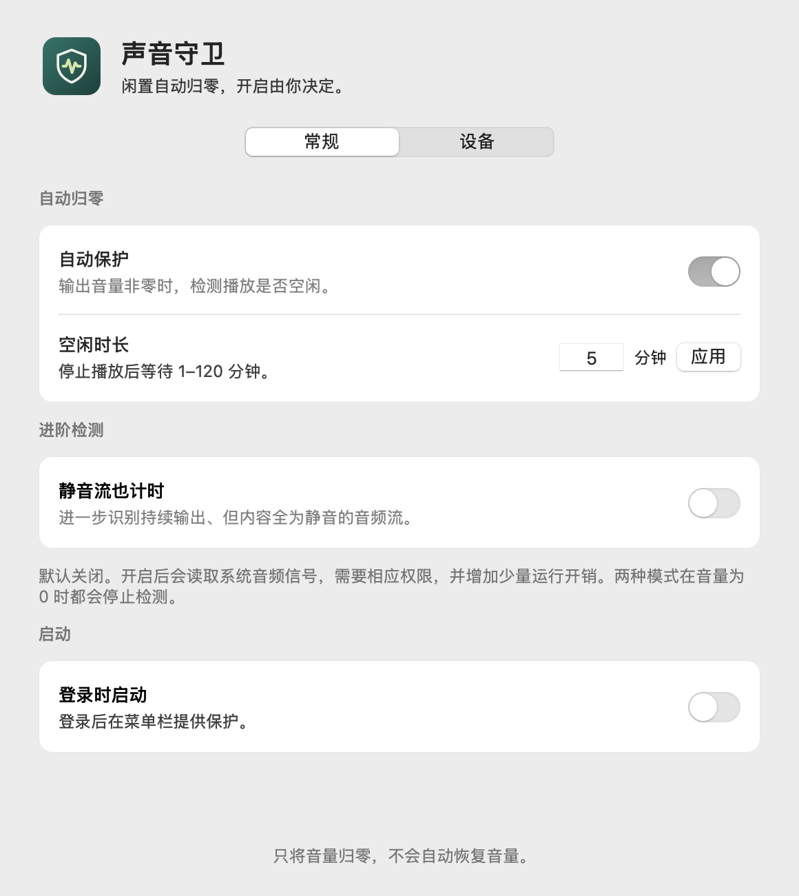
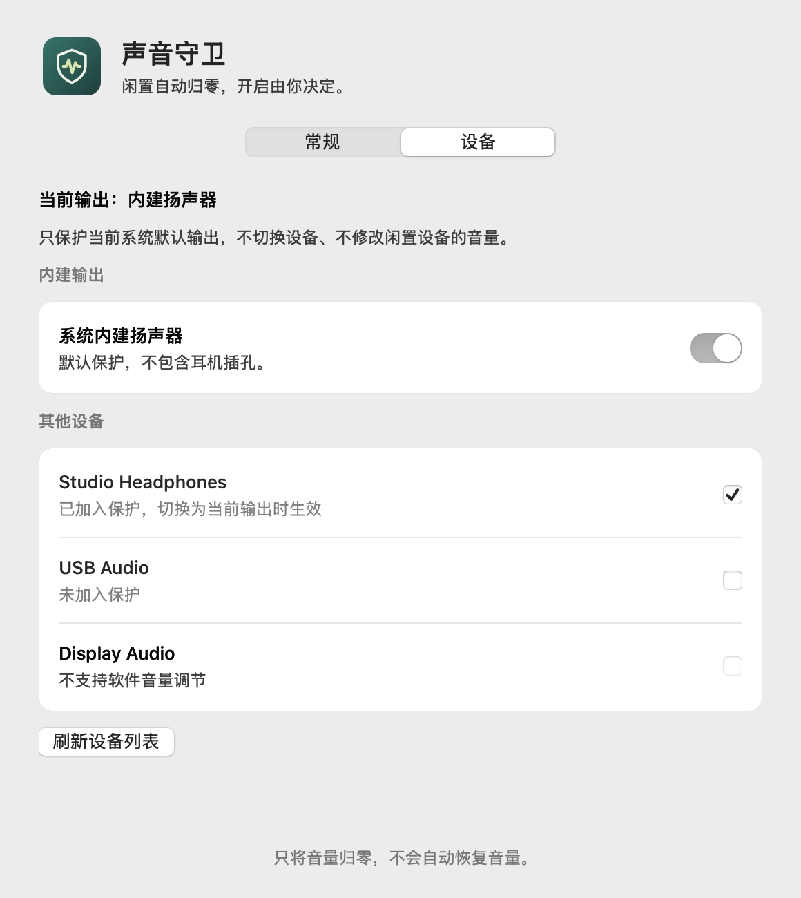
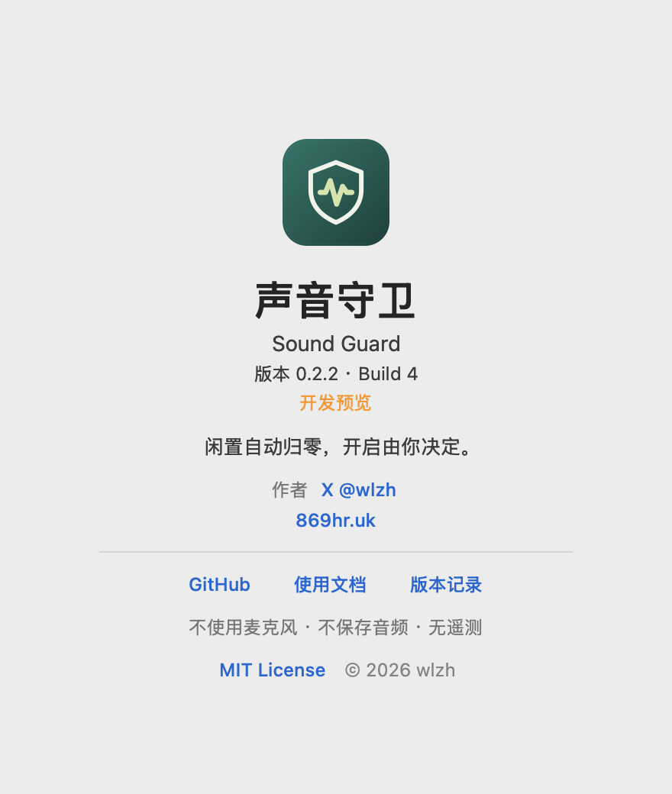

# Sound Guard · 声音守卫

面向 macOS 的声音管理 App：输出音量开启后，长时间没有播放活动便自动把系统输出音量设为 0，绝不自动恢复音量。



**v0.2.2 / build 4：开发预览。** 已实现原生 App、两种检测模式、设备白名单、设置与关于。尚未完成全部设备与长期性能验收，具体证据及限制见[测试报告](docs/TESTING.md)，不将构建成功当作全部实机通过。

上图为 v0.2.0 实机截图；v0.2.2 收紧了菜单顶部，设备名称与音量左右分列。以下为当前代码原生渲染的深色顶部预览：



## 功能

- 菜单栏驻留，默认空闲 5 分钟归零，可设置 1–120 分钟。
- 默认仅保护内建扬声器。其他输出设备逐项勾选，只有成为系统默认输出时才检测，不修改闲置设备。
- “静音流也计时”默认关闭。开启后额外分析系统输出的数字静音，不采集麦克风。
- 音量为 0 时停止播放活动检测与空闲计时，只接收必要的系统状态变化通知。
- 只把音量降到 0；播放恢复、启动、退出、升级均不得自动提高音量。
- 不使用麦克风、不保存音频、不上传数据；首版暂不包含麦克风管理。
- 播放中不归零；设备切换、睡眠唤醒、错误恢复重新给予完整等待时间。
- 状态、暂停、立即归零、设置、登录启动、关于及许可证入口。

**两种模式都在非零音量时检测。** 默认模式监听输出播放活动，持续输出静音流仍视为正在播放；启用“静音流也计时”后分析系统音频信号，仅全零样本算静音，任何非零声音均重置等待。开启后可能需要系统音频录制权限，开销高于默认模式；缺失回调、未知状态或写入失败会停止保护并提示重试，不被当成静音。

## 文档与检查

- [v0.2.2 产品需求与验收清单](docs/prd/v0.2.2/prd.md)
- [文档索引及交付状态](docs/README.md)
- [测试状态与发布门禁](docs/TESTING.md)
- [贡献说明](CONTRIBUTING.md)、[安全说明](SECURITY.md)、[版本记录](CHANGELOG.md)

## 构建与使用

需要 macOS 14.2+ 和 Swift 5.10+ 工具链。无需第三方运行时、驱动或麦克风/辅助功能权限。App 仅菜单栏驻留，没有 Dock 图标。

```sh
zsh scripts/test-all.sh
zsh scripts/build-app.sh
open "dist/Sound Guard.app"
```

## 作者与许可

作者：[wlzh](https://github.com/wlzh)。网站：[869hr.uk](https://869hr.uk)。
分发包由 `zsh scripts/package-release.sh` 生成 Universal ZIP 和 SHA256。当前仅 ad-hoc 签名、未公证；安装和系统拦截处理见[安装指南](docs/INSTALL.md)。公开 Release 可直接下载。

源码采用 [MIT License](LICENSE)。仓库公开开源。关于窗口展示版本、作者、网站及项目链接，完整协议通过独立面板查看。

## 界面

盾牌与声波组成品牌标记，菜单栏使用单色模板，App 图标使用绿色底色。设置拆分为常规和设备页；关于页参考同作者两个原生工程重设计。

以下为真实原生视图使用模拟设备生成的预览，不包含用户设备数据。




